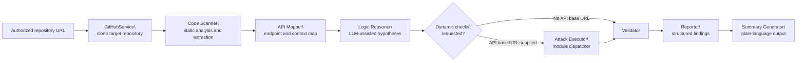
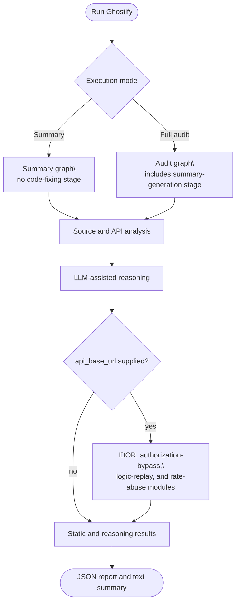

# Ghostify

Ghostify is an experimental, LangGraph-based system for authorized application-security assessment. It combines repository inspection, API mapping, LLM-assisted reasoning, constrained HTTP test modules, validation, and reporting into an explicit audit workflow. It is designed to help a human reviewer investigate security hypotheses; it does not establish that software is secure, and its findings require independent verification.

> **Authorized use only.** Run Ghostify only against systems you own or have explicit permission to test. Dynamic checks can make HTTP requests and may affect target systems. Do not use it against public services, third-party repositories, or production environments without written authorization and an agreed testing scope.

## Browser app and deployment

[Deploy Ghostify on Render](https://render.com/deploy?repo=https://github.com/quixoticalcoder/ghostify)

The repository now includes a Streamlit interface and a Docker-based Render Blueprint. The link starts deployment setup; it is **not** an already-running application URL. After the build succeeds, Render assigns the public app URL.

1. Create or sign in to a Render account and open the deployment link.
2. Provide `GOOGLE_API_KEY` and choose a strong `GHOSTIFY_ACCESS_PASSWORD` in Render's environment fields. Do not commit these values.
3. Deploy the Blueprint, wait for its health check to pass, and open the service URL.
4. Enter the access password, supply an authorized public repository URL, and download the report when analysis finishes.

The Blueprint selects Render's free plan. Free services sleep when idle and have limited resources; larger repositories may require more memory. Consult [Render's free-service limits](https://render.com/docs/free) before changing plans. Gemini usage is separate and depends on your Google account and quotas.

Hosted analysis accepts repositories owned by `quixoticalcoder` by default. Set the comma-separated `GHOSTIFY_ALLOWED_OWNERS` variable to change that scope. The web interface always uses the source-only summary workflow with `api_base_url=None`; the CLI remains available for separately authorized dynamic tests. Findings and source excerpts can be sent to Google Gemini. Tracing is disabled in hosted workers.

`GEMINI_MODEL` is configurable in Render; the Blueprint uses `gemini-3.5-flash-lite` from [Google's model catalog](https://ai.google.dev/gemini-api/docs/models). Availability must be verified with your API key. This deployment has not been tested with a live provider credential.

One audit runs at a time per application process, with a ten-minute deadline. Temporary clones and worker output are removed after completion or failure. Results remain in the browser session until sign-out or session loss; download them before closing the app. There is no persistent report database. Scanner failures can reduce coverage without failing the entire legacy pipeline; a report is not assurance that every scanner completed.

For local browser use on Linux or macOS:

```bash
pip install -r requirements-web.txt
export GOOGLE_API_KEY="your-key"
export GEMINI_MODEL="gemini-3.5-flash-lite"
export GHOSTIFY_ACCESS_PASSWORD="choose-a-strong-password"
python -m streamlit run streamlit_app.py
```

For a container deployment, build the included `Dockerfile` and provide the same variables through your host's secrets manager. The image runs as a non-root user, respects `PORT`, and exposes Streamlit's `/_stcore/health` endpoint.

Run web tests without making live provider calls:

```bash
pip install pytest
PYTHONPATH=.:backend python -m pytest tests/test_web.py -q
```

## Overview

Traditional static-analysis tools are valuable for known vulnerability patterns, but they do not independently establish whether a system's authorization, business logic, or multi-step workflows are secure. Ghostify explores this gap by coordinating complementary analysis stages:

- repository cloning and source inspection;
- static checks for selected Python and FastAPI patterns;
- endpoint and API-context extraction;
- LLM-assisted generation of security hypotheses;
- deterministic, module-based dynamic checks when an API base URL is supplied;
- validation and normalization of collected results; and
- JSON and text-based audit artifacts.

The project is a research prototype, not a production security-control platform. LLM-generated hypotheses can be incomplete or incorrect, static rules have limited coverage, and a lack of findings is not evidence that vulnerabilities are absent.

## Architecture



### Audit workflow



## Implemented components

| Component | Repository implementation |
|---|---|
| Orchestration | Two compiled LangGraph workflows: an audit graph and a summary graph. |
| Repository access | `GitPython`-based cloning through `GitHubService`. |
| Static analysis | Code-scanner agents and selected security tools/rules, including FastAPI-oriented checks. |
| API mapping | Endpoint extraction and normalization through the API-mapper agent. |
| Reasoning | A planner stage that uses the configured LLM provider to formulate hypotheses from repository context. |
| Dynamic modules | Dispatcher-backed modules for IDOR, authorization bypass, logic replay, and rate-abuse checks when `api_base_url` is provided. |
| Validation | Validator rules classify collected dynamic results as confirmed findings or false positives. |
| Reporting | Reporter and summary-generator agents assemble structured findings and human-readable summaries. |
| Observability | LangSmith configuration is available through environment variables. |

## Safety model and limits

Ghostify contains useful safeguards, but they are controls to review and configure—not guarantees.

- Dynamic request modules are selected from a predefined dispatcher rather than generated as executable code by the LLM.
- `MAX_ATTACKS_PER_ENDPOINT`, `MAX_REQUESTS_PER_MINUTE`, `ATTACK_TIMEOUT_SECONDS`, and rate-test settings are configurable.
- `ALLOWED_TARGET_DOMAINS` defaults to `localhost` and `127.0.0.1`. Before any dynamic use, review the source, target authorization, and configuration. The current executor should be treated as experimental: the declared domain-validation helper is not invoked by the dispatcher path.
- The LLM may produce unreliable hypotheses. Validation reduces, but cannot eliminate, false positives or false negatives.
- Reports can contain sensitive paths, endpoints, or evidence. Protect the generated `reports/` directory appropriately.

## Requirements

- Python 3.10 or later (the code uses modern union-type syntax).
- Git, available on `PATH`.
- A Google API key for the default Gemini provider.
- Optional: LangSmith credentials for tracing.
- An authorized, isolated target API only if dynamic checks are intentionally enabled.

Python dependencies are listed in [requirements.txt](requirements.txt). The current implementation uses LangGraph, LangChain, [Google Gemini](https://ai.google.dev/gemini-api/docs/api-key), GitPython, and optional [LangSmith](https://docs.smith.langchain.com/).

## Installation

```bash
git clone https://github.com/quixoticalcoder/ghostify.git
cd ghostify

python -m venv .venv
source .venv/bin/activate        # Windows PowerShell: .venv\\Scripts\\Activate.ps1
pip install -r requirements.txt
cp .env.example .env
```

Ghostify reads configuration from environment variables and the local `.env` file created above. Replace the placeholder values in that file; do not commit credentials.

```bash
export GOOGLE_API_KEY="your-google-api-key"

# Optional tracing
export LANGCHAIN_TRACING_V2=true
export LANGCHAIN_API_KEY="your-langsmith-api-key"
export LANGCHAIN_PROJECT="ghostify"
```

The default provider is Gemini. Configuration also declares an optional Groq provider; review `backend/app/core/config.py` and install/configure the corresponding provider integration before selecting it.

## Usage

Run commands from the repository root.

### Summary mode

Summary mode invokes the analysis workflow and generates an audit report plus a human-readable summary. It does not modify the cloned target repository.

```bash
python run_summary.py https://github.com/OWNER/REPOSITORY
```

The CLI can optionally prompt for a locally running API. Decline that prompt for source-focused analysis. Supply an API base URL only for an authorized test environment.

### Audit mode

```bash
python run_audit.py https://github.com/OWNER/REPOSITORY
```

The audit workflow includes the same repository analysis and may run configured dynamic modules when a local API URL is selected. Review target scope and configuration before proceeding.

### Programmatic use

```python
from pathlib import Path
import sys

sys.path.insert(0, str(Path.cwd() / "backend"))

from app.agentic.graph.audit_graph import summary_app
from app.services.github import GitHubService

github = GitHubService(repo_url="https://github.com/OWNER/REPOSITORY")
repo_path = github.clone()

try:
    result = summary_app.invoke(
        {
            "repo_url": "https://github.com/OWNER/REPOSITORY",
            "repo_path": repo_path,
            "commit_hash": None,
            "api_base_url": None,
        }
    )
    print(result["final_report"])
finally:
    github.cleanup()
```

Use `audit_app` instead of `summary_app` only after assessing the implications of supplying an authorized `api_base_url`.

## Output

The command-line entry points create timestamped artifacts in `reports/`:

- `audit_report_<timestamp>.json` — structured findings and summary data.
- `security_summary_<timestamp>.txt` — a plain-language summary, when generated.

Finding quality depends on source coverage, tool behavior, API observability, LLM availability, and the validator rules. Treat outputs as review inputs, not final determinations.

## Testing

```bash
pytest
pytest -m integration
pytest -v -s
pytest backend/tests/test_audit_graph.py
```

The integration test clones and analyzes a repository and can call configured providers; set `TEST_REPO_URL`, `TEST_API_BASE_URL`, and `TEST_COMMIT_HASH` deliberately. Run it only with appropriate credentials and authorization.

## Repository layout

```text
backend/
  app/
    agentic/       LangGraph state, agents, graph, and routing
    core/          Configuration, logging, constants, and safety helpers
    services/      Repository cloning, HTTP client, storage, and API helpers
  tests/           Integration test for the audit graph
run_summary.py     Summary-oriented command-line entry point
run_audit.py       Audit command-line entry point
requirements.txt   Python dependency list
langgraph.json     LangGraph development configuration
```

## Academic and operational limitations

Ghostify demonstrates an approach to agentic security assessment. It does not provide a benchmarked detection rate, a formal proof of safety, or a complete threat model. Any academic use should describe:

- the authorized target scope and test environment;
- dependency and model versions;
- prompts, configuration, and rate limits used;
- how candidate findings were independently reproduced;
- false positives and false negatives observed; and
- the distinction between static evidence, dynamic evidence, and LLM-generated interpretation.

## Contributing

Contributions are welcome. Before opening a pull request, keep changes scoped, add or update tests where applicable, and avoid committing credentials or generated reports.

## License

No license file is currently included in this repository. Do not assume permission to reuse, redistribute, or deploy the code beyond the rights granted by its copyright holder.
